<div class="callout callout--why">
  <strong>Why this matters</strong>
  You ask Claude Code to "add end-to-end tests for the checkout flow." Without any guidance from you, it reads the existing tests, identifies the checkout components, writes new tests, runs them, sees failures, reads the error output, fixes the implementation, and runs them again until they pass. You didn't direct each step — it just kept going. That's an agent. This lesson explains exactly how that loop works, and how to design multi-agent systems when one agent isn't enough.
</div>

## Learning objectives

By the end of this lesson, you will be able to:

- Explain the agentic loop and how `stop_reason` drives termination (not text parsing or iteration caps)
- Design hub-and-spoke orchestration with correct task decomposition
- Identify what the Claude Agent SDK requires to spawn subagents correctly

## What is an AI agent?

An **agent** is an AI model that doesn't just answer a question and stop — it takes a sequence of actions to complete a goal. Instead of responding once, it can use tools (like reading files, running code, or browsing the web), observe what happened, and decide what to do next.

Think of the difference between asking a colleague "what's in this file?" (one answer) vs. asking them to "fix the bug in this codebase" — the second task requires them to explore, try things, check results, and keep going until it's done. That's an agent.

**Claude Code** is a concrete example of an agent: when you ask it to add a feature, it reads files, writes edits, runs tests, reads the output, fixes errors — all on its own, in a loop.

## The agentic loop

Every agent — including Claude Code — runs the same core cycle:

1. **Gather context** — read the current state: the task, files, tool results so far
2. **Decide** — choose what to do next: reply, or call a tool
3. **Act** — execute the tool call (e.g. read a file, run a command)
4. **Observe** — read the result and add it to context
5. **Repeat** — until the task is done or a stop condition is hit

**Example:** You ask Claude Code to "add input validation to the login form."
- It reads the login form file *(gather)*
- It decides to also read the validation utilities *(decide → act → observe)*
- It writes the new validation logic *(decide → act)*
- It runs the test suite *(act → observe)*
- It sees a failing test, fixes it *(observe → decide → act)*
- All tests pass — it stops *(stop condition)*

This loop continues automatically. You don't direct each step.

```mermaid
flowchart TD
    A(["You send a task"]) --> B["1 · Gather context\nread task, files, prior results"]
    B --> C{"2 · Decide\nwhat next?"}
    C -->|"Call a tool"| D["3 · Act\nexecute the tool"]
    D --> E["4 · Observe\nadd result to context"]
    E --> C
    C -->|"Task complete"| F(["Present final answer"])
    style A fill:#252a38,stroke:#3a4058
    style F fill:#16271c,stroke:#5bbf7a,color:#e6e8ee
```



## stop_reason mechanics

<div class="callout callout--sdk">
  <strong>Exam knowledge — Claude Agent SDK</strong>
  This section describes API-level loop mechanics. When you use Claude Code as a CLI tool, this loop runs for you automatically — you never write this code yourself. The exam tests whether you understand how it works under the hood so you can reason about agent behavior and avoid common anti-patterns.
</div>

This is one of the most heavily tested topics on the exam. The agentic loop in the Claude Agent SDK doesn't guess when to stop — it inspects the `stop_reason` field on every API response and uses that to decide what to do next.

There are two primary stop reasons to know:

- **`"tool_use"`** — Claude wants to call a tool. The loop should execute the requested tool, append the tool result to the conversation history, and call the API again. The loop is not done.
- **`"end_turn"`** — Claude is finished. Present the final response to the user and stop the loop.

Visualizing this as code logic:

```
while true:
  response = call_claude_api(messages)
  if response.stop_reason == "tool_use":
    result = execute_tool(response.tool_call)
    messages.append(tool_result(result))
    continue                     // loop again
  else if response.stop_reason == "end_turn":
    present(response.final_text)
    break                        // done
```

**Anti-patterns the exam tests against:**

- **Parsing natural language signals** — don't scan the assistant's text for phrases like "I'm done" or "task complete" to decide when to stop. The model may say that mid-task. Use `stop_reason`.
- **Arbitrary iteration caps as the primary stop condition** — a hard limit like "stop after 10 turns" is a safety net, not the main termination logic. The primary stop is always `stop_reason == "end_turn"`.
- **Checking for assistant text content as a completion indicator** — the presence or absence of text in the response is not a reliable signal. Always use `stop_reason`.

```mermaid
flowchart TD
    A["Call Claude API"] --> B{"stop_reason?"}
    B -->|"tool_use"| C["Execute the tool"]
    C --> D["Append result to messages"]
    D --> A
    B -->|"end_turn"| E(["Show response to user\n— DONE"])
    style B fill:#3a2a24,stroke:#d97757
    style E fill:#16271c,stroke:#5bbf7a,color:#e6e8ee
```



## Single-agent vs. multi-agent

### Single agent
One loop, one context window, one Claude instance handling everything.

- **When to use it:** The task is focused and fits in one conversation — e.g. "refactor this module."
- **Advantages:** Simple, predictable, cheaper, no coordination overhead.
- **Limitation:** One agent can only do one thing at a time, and everything it has seen shares the same context window.

### Multi-agent
A **coordinator** agent splits a large task into sub-tasks and delegates each one to a **worker** agent. Each worker has its *own* fresh context window and runs independently.

- **When to use it:** Work can be done in parallel (e.g. analyze 10 files simultaneously), or you want to prevent one sub-task's details from polluting another's context.
- **Example:** A research task where one agent searches documentation, another analyzes code, and a third writes a summary — all running at the same time.

In the Claude Agent SDK, sub-agents are spawned using the **Task tool**. Each runs in isolation and returns only its final result to the parent, keeping the parent's context clean.

## Hub-and-spoke (orchestrator–worker)

The most common multi-agent pattern looks like a wheel:

```
         Worker A
        /
Orchestrator — Worker B
        \
         Worker C
```

- The **orchestrator** (hub) receives the goal, breaks it into pieces, and hands each piece to a worker.
- **Workers** (spokes) execute their piece and return results to the orchestrator.
- Workers never talk directly to each other — all coordination goes through the hub.

**Why this matters:**
- With 3 workers, you have 3 communication paths (each worker ↔ hub) instead of 6 (every worker ↔ every other worker). Simpler to reason about and debug.
- If a worker fails, the orchestrator handles it — workers don't need to know about each other.

```mermaid
flowchart TD
    O["Orchestrator\n(hub)"] -->|"sub-task A"| WA["Worker A"]
    O -->|"sub-task B"| WB["Worker B"]
    O -->|"sub-task C"| WC["Worker C"]
    WA -->|"result A"| O
    WB -->|"result B"| O
    WC -->|"result C"| O
    style O fill:#3a2a24,stroke:#d97757
```



**Real example:** An orchestrator is asked to audit a codebase for security issues. It spawns one worker per directory, each scanning independently. Workers return findings; the orchestrator merges and ranks them.

## The Task tool and subagent spawning

<div class="callout callout--sdk">
  <strong>Exam knowledge — Claude Agent SDK</strong>
  The <code>Task</code> tool and <code>AgentDefinition</code> are Claude Agent SDK concepts for building custom multi-agent systems with direct API access. In Claude Code, you observe orchestration behavior (for example in plan mode), but you don't configure <code>allowedTools</code> or spawn subagents programmatically yourself. The exam tests this as foundational architecture knowledge.
</div>

The `Task` tool is the specific mechanism in the Claude Agent SDK for spawning subagents from a coordinator.

A few things the exam tests closely:

**The coordinator needs permission to use it.** The coordinator's `allowedTools` list MUST include `"Task"`. If Task is not in that list, the coordinator cannot spawn any subagents — you'll get a tool-not-found error.

**Subagents do NOT inherit parent context.** When you spawn a subagent, it starts with a completely blank conversation. It does not automatically see what the coordinator has done, what files it has read, or what decisions it has made. All necessary context must be passed explicitly in the subagent's prompt. If the coordinator has discovered that a bug lives in `src/auth/token.ts`, it must write that fact into the subagent's prompt — the subagent will not know otherwise.

**`AgentDefinition` configures each subagent type.** You define subagent types ahead of time using `AgentDefinition`, which sets the description, system prompt, and tool restrictions for each role. The coordinator then spawns instances of these defined types.

**Spawning in parallel requires a single coordinator response.** To run multiple subagents at the same time, the coordinator must emit multiple Task tool calls within a SINGLE response turn. If the coordinator calls Task once, waits for the result, then calls Task again, those subagents run sequentially. Parallelism requires that all the Task calls go out together in one turn.

```
Single response with 3 Task calls → 3 subagents run in parallel ✓
Turn 1: Task call A → wait → Turn 2: Task call B → sequential ✗
```



```mermaid
flowchart TD
    subgraph par ["✓ Parallel — all Task calls in one response turn"]
        Cp["Coordinator"] -->|"single turn"| T1["Task A"]
        Cp -->|"single turn"| T2["Task B"]
        Cp -->|"single turn"| T3["Task C"]
    end
    subgraph seq ["✗ Sequential — one Task call per turn"]
        Cs["Coordinator"] -->|"turn 1"| T4["Task A"]
        T4 -.->|"wait"| Cs
        Cs -->|"turn 2"| T5["Task B"]
        T5 -.->|"wait"| Cs
        Cs -->|"turn 3"| T6["Task C"]
    end
    style par fill:#0f1d14,stroke:#5bbf7a
    style seq fill:#1d0f0f,stroke:#e06c6c
```

## Task decomposition strategies

How you break a big task into smaller pieces matters as much as the multi-agent machinery itself.

### Prompt chaining
Fixed sequential steps where each step feeds its output into the next.

**When to use it:** The workflow is predictable and you know all the steps in advance. A good example is a multi-aspect code review: Step 1 checks logic correctness, Step 2 checks security, Step 3 checks performance, Step 4 synthesizes the findings. Each step has a fixed role and a defined input.

**Advantage:** Easy to reason about, easy to debug a specific step.

### Dynamic decomposition
The coordinator generates subtasks based on what it discovers during the task — the plan is not fixed in advance.

**When to use it:** Open-ended investigations where the scope is unknown upfront. A coordinator asked to "audit this codebase" might read the file tree, discover there are 3 services, then dynamically decide to spawn one worker per service. It couldn't have planned those workers before it looked.

**Advantage:** Adapts to what's actually found rather than assuming structure.

### Code review decomposition (a common exam scenario)
For code review specifically: split into **per-file local analysis passes** plus a **separate cross-file integration pass**.

Why? If you send all files to one agent, its attention gets diluted — it may miss issues in later files, or make contradictory findings across files (flagging a pattern as a bug in one file while praising the same pattern in another). By giving each file its own analysis pass and then doing a dedicated integration pass, you get higher-quality findings and consistent cross-file reasoning.

## Session management

Long-running or multi-session work requires deliberate session design.

### Resuming named sessions
Use `--resume <session-name>` to continue a prior session by name. The agent picks up with the prior context intact.

**When to resume:** When the prior context is still valid — the files haven't changed significantly, the task direction is the same, and you want to pick up where you left off rather than re-establish context.

**When to start fresh instead:** When prior tool results are stale (e.g., the codebase has been significantly refactored since the last session). Starting fresh with an injected structured summary — a written description of what was previously learned — is more reliable than resuming and hoping the agent ignores outdated tool results.

**Key tip when resuming:** Explicitly tell the agent which files changed since the last session. The agent cannot detect this on its own, and stale file knowledge is the most common source of errors after resume.

### Forking sessions
`fork_session` creates an independent branch from a shared analysis baseline. This is useful when you want to compare two implementation approaches — both start from the same "we've analyzed the requirements" baseline, but then diverge to explore Option A vs. Option B independently, without one exploration polluting the other.

## Lifecycle hooks

Hooks let you run **your own code** at specific moments in the agent's lifecycle — before a tool runs, after it finishes, when the agent stops, etc.

| Hook event | When it fires |
|---|---|
| `PreToolUse` | Before the agent calls any tool |
| `PostToolUse` | After a tool call completes |
| `UserPromptSubmit` | When the user sends a message |
| `Stop` | When the agent finishes |

**Why hooks exist:** The agent (the model) decides what to do, but hooks are run by the **harness** (the software running the agent). This means the model cannot skip them — they are enforced deterministically.

**What you'd use hooks for:**
- Auto-format code after every file edit
- Scan for secrets before any commit
- Block specific dangerous commands unconditionally
- Log every tool call for auditing

**Example:** A `PreToolUse` hook that checks if the agent is about to run `rm -rf` and blocks it before it happens — no matter what the model decides.

## What to remember for the exam

- The agentic loop is: **gather context → decide → act → observe → repeat**.
- The loop terminates on **`stop_reason`**: `"tool_use"` means keep going; `"end_turn"` means stop. Do not use text parsing, iteration caps, or content checks as the primary termination signal.
- Choose **single-agent** by default; add multi-agent only when you need parallelism or context isolation.
- **Hub-and-spoke** means an orchestrator coordinates workers; workers don't talk to each other.
- The **Task tool** spawns subagents. The coordinator's `allowedTools` must include `"Task"`. Subagents do not inherit parent context — pass everything explicitly.
- To run subagents **in parallel**, emit all Task calls in a single coordinator response turn.
- **`AgentDefinition`** configures subagent types: system prompt, description, allowed tools.
- **Prompt chaining** = fixed sequential steps; **dynamic decomposition** = coordinator decides structure at runtime.
- For code reviews: per-file local passes + separate cross-file integration pass prevents attention dilution and contradictory findings.
- **Hooks** are enforced by the harness (not the model), so they cannot be skipped — use them for non-negotiable policy.
- `--resume` to continue a prior session; `fork_session` to branch from a shared baseline; start fresh (with a structured summary) when tool results are stale.
