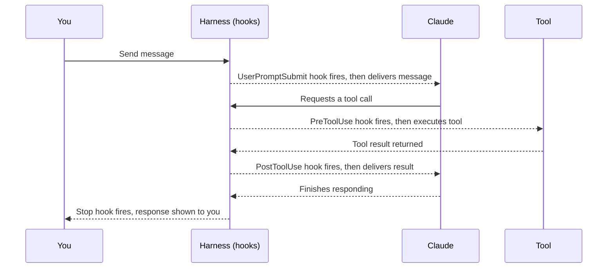

<div class="callout callout--why">
  <strong>Why this matters</strong>
  You open a project and ask Claude Code to "refactor all API routes to use async/await." It makes 30 file changes — but half touch auto-generated files you never edit by hand, and the formatting is completely wrong. You spend an hour undoing it. Now imagine Claude already knew which files were off-limits, what your formatting rules were, and which tests to run when it finishes. That's what this lesson builds.
</div>

## Learning objectives

By the end of this lesson, you will be able to:

- Set up CLAUDE.md so Claude always knows your project's conventions without you re-explaining them each session
- Create slash commands, skills, and hooks to automate repeatable workflows
- Run Claude Code headlessly in CI/CD pipelines with structured output

## What is Claude Code?

**Claude Code** is a command-line tool (and IDE extension) that lets you work with Claude directly inside your codebase. Instead of copying and pasting code into a chat window, Claude Code can read your files, make edits, run commands, and work autonomously on tasks — all from your terminal or editor.

## CLAUDE.md — project memory

Every time Claude Code starts in a project, it automatically reads a file called `CLAUDE.md` if one exists. This is your project's **persistent memory** — facts that Claude should always know about your codebase.

**What to put in CLAUDE.md:**
- How to build and test the project (`npm run build`, `pytest`, etc.)
- Architectural decisions and conventions ("we use snake_case for all database fields")
- Gotchas and non-obvious constraints ("never edit generated files in `/dist`")
- Key file locations ("API routes are in `src/routes/`")

**What not to put there:**
- Things Claude can figure out by reading the code
- Generic best practices that apply to every project

Keep it concise — it loads into the context window on every turn, so a bloated CLAUDE.md wastes your token budget.

**Example CLAUDE.md:**
```markdown
# CLAUDE.md

Run tests: `npm test`
Build: `npm run build` → output in `./dist`

Never modify files in `src/generated/` — they are auto-created by the build.
Database column names use snake_case; TypeScript fields use camelCase.
```

## CLAUDE.md hierarchy — three levels

CLAUDE.md isn't just one file. There are three levels, each with different scope:

**User-level:** `~/.claude/CLAUDE.md` — your personal instructions that apply to every project. This file is **not shared with teammates** — it lives only on your machine and is never version-controlled. Use it for personal preferences like "always use TypeScript strict mode" or "I prefer functional components."

**Project-level:** `CLAUDE.md` at the project root (or `.claude/CLAUDE.md`) — shared with the team via git. This is the main project memory everyone benefits from.

**Directory-level:** `CLAUDE.md` files inside subdirectories — Claude loads them automatically when working in that area. Useful for subsystem-specific context, like a `src/auth/CLAUDE.md` that explains authentication conventions.

### `@import` syntax
To keep CLAUDE.md files modular, use `@import` to reference external files:

```markdown
@import ./standards/typescript.md
@import ./standards/testing.md
```

This lets you split a large CLAUDE.md into topic-specific files without bloating the main file.

### `.claude/rules/` directory
An alternative to a monolithic CLAUDE.md is the `.claude/rules/` directory — topic-specific files like `testing.md`, `api-conventions.md`, `database.md`. Each file is focused on one area, making it easier to maintain and update individual sections.

```mermaid
flowchart TD
    U["~/.claude/CLAUDE.md\nUser level\nPersonal · never committed · applies to every project"]
    P["CLAUDE.md  (project root)\nProject level\nCommitted to git · shared with the whole team"]
    D["src/auth/CLAUDE.md\nDirectory level\nAuto-loaded when Claude works in that folder"]
    All(["When working in src/auth/ —\nall three files load simultaneously"])

    U --> P --> D --> All

    style U fill:#252a38,stroke:#d97757
    style P fill:#252a38,stroke:#3a4058
    style D fill:#252a38,stroke:#3a4058
    style All fill:#16271c,stroke:#5bbf7a,color:#e6e8ee
```



### Diagnosing inconsistent behavior
Use the `/memory` command to see exactly which memory files are currently loaded. If Claude is ignoring a rule you wrote, `/memory` will show you whether the file is actually being picked up.

## Path-specific rules

Sometimes you want rules that only apply to certain types of files — test files, Terraform configs, database migrations. Rather than loading those rules for every edit, use path-specific rules.

Files in `.claude/rules/` can include YAML frontmatter with a `paths:` field containing glob patterns:

```markdown
---
paths:
  - "terraform/**/*"
---

Always run `terraform fmt` before suggesting changes.
Never use `count` for resources that may need individual addressing — use `for_each`.
```

This rule loads only when Claude is editing files matching `terraform/**/*`. When you're editing a TypeScript file, this rule is invisible to Claude.

**Why this beats subdirectory CLAUDE.md:** Subdirectory files apply to everything in that directory. Path-specific rules can cross directory boundaries — for example, `paths: ["**/*.test.tsx"]` applies to all test files regardless of where they live in the project.

## Settings and permissions

Claude Code's behavior is controlled by `.claude/settings.json`. This file lets you:

- **Allow** specific commands to run without asking for confirmation (e.g. `npm test`)
- **Deny** dangerous operations unconditionally (e.g. `rm -rf`)
- Set environment variables
- Configure hooks (see below)

```json
{
  "permissions": {
    "allow": ["npm test", "npm run build"],
    "deny": ["rm -rf"]
  }
}
```

**Two settings files:**
- `.claude/settings.json` — committed to git; shared with the whole team
- `.claude/settings.local.json` — git-ignored; personal overrides (your API keys, personal preferences)

This separation means you can pre-approve safe commands for everyone on the team, while keeping personal configuration private.

## Slash commands — reusable prompt shortcuts

A **slash command** is a saved prompt you can invoke by typing `/command-name`. They're stored as Markdown files in `.claude/commands/`.

**Example:** Create `.claude/commands/review.md` containing:
```markdown
Review the staged changes for bugs and style issues.
List each finding with the file name, line number, and a one-sentence description.
```

Now you can type `/review` anytime instead of rewriting that prompt. Slash commands can also accept arguments.

**Two scopes for slash commands:**
- **Project-scoped:** `.claude/commands/` — committed to git, shared with the team. Everyone gets the same commands.
- **User-scoped:** `~/.claude/commands/` — personal, not shared. Your own shortcuts that don't belong to a specific project.

**Good uses for slash commands:**
- Code review checklists
- Release notes generation
- Scaffolding boilerplate (new component, new API route)
- Any task you do repeatedly with the same instructions

## Agent Skills — expertise loaded on demand

**Skills** are like more powerful slash commands. A skill packages expertise — instructions, scripts, and context — into a folder with a `SKILL.md` file.

The key difference from CLAUDE.md:
- `CLAUDE.md` is **always loaded** (every turn)
- A skill is loaded **only when Claude decides it's relevant** to the current task

This means you can have many skills without bloating the context window. Claude reads skill descriptions and pulls in the full skill body only when it matches what you're asking for.

```mermaid
flowchart LR
    T["Current task"]
    subgraph Always["Every turn — always loaded"]
        CM["CLAUDE.md\nProject rules · commands · conventions"]
    end
    subgraph OnDemand["On demand — loaded when relevant"]
        S1["security-review skill"]
        S2["scaffold-component skill"]
        S3["deploy-checklist skill"]
    end
    T -->|"always"| CM
    T -->|"Claude reads descriptions\nloads only if relevant"| OnDemand
    style Always fill:#0f1d14,stroke:#5bbf7a
    style OnDemand fill:#1b1f2a,stroke:#3a4058
    style CM fill:#16271c,stroke:#5bbf7a,color:#e6e8ee
```



**Example skill use:** A "security-review" skill that knows how to check for OWASP vulnerabilities. It only loads when you ask Claude to review for security — not during every regular edit.

**Two scopes for skills:**
- **Project skills:** `.claude/skills/` — shared with the team via git.
- **Personal skills:** `~/.claude/skills/` — your own skills, not shared.

### Skill frontmatter options
Skills support YAML frontmatter options that control how they run:

**`context: fork`** — runs the skill in an isolated sub-agent, preventing the skill's verbose output from polluting your main conversation. Use this for long-running analysis skills where you only want the final result.

**`allowed-tools`** — restricts which tools the skill can use during execution. A documentation skill might only need Read and Write, not Bash. This is both a safety feature and a focus tool.

**`argument-hint`** — a prompt that appears when you invoke the skill without arguments. It tells you what parameters the skill needs. For example: `argument-hint: "Which component do you want to scaffold? (e.g. Button, Modal, Form)"`.

## Plan mode — review before acting

By default, Claude Code acts immediately: it reads files, makes edits, runs commands. **Plan mode** changes this: Claude researches the task and writes a plan, but does **not** make any edits until you approve.

**When to use plan mode:**
- Large refactors that touch many files
- Risky changes (migrations, API changes, deletions)
- Anytime you want to understand Claude's approach before it runs

You enable it with `/plan` or by configuring it in settings for certain types of tasks.

## Iterative refinement techniques

Getting the right output from Claude often takes iteration. These techniques make iteration more productive.

### Concrete examples beat prose
When instructions are being interpreted inconsistently, adding examples usually fixes it faster than rewording the prose. Instead of elaborating on what "a good commit message" means, show 3 examples of good commit messages and 2 examples of bad ones.

### Test-driven iteration
Write tests that capture the desired behavior first. Then, when iterating, share failing tests with Claude. "These 3 tests are failing — fix the implementation until they all pass" is a much cleaner feedback loop than "this doesn't feel right."

### The interview pattern
For complex tasks with non-obvious requirements, ask Claude to interview you before implementing. Instead of jumping straight to code, Claude asks: "What's the expected behavior when the cache expires? What happens if the upstream service is unavailable?"

This surfaces requirements you didn't know you needed to specify — cache invalidation strategies, failure modes, edge cases. It's especially effective for system design tasks.

### Batching vs. sequential fixes
When Claude finds multiple issues, decide whether to fix them together or one at a time:

- **Batch** when the fixes interact with each other — changing a function signature that several callers need to update, for example.
- **Sequential** for independent issues — it's easier to review each fix in isolation and confirm it's correct before moving to the next one.

## Hooks — automation that can't be skipped

Hooks are shell commands that run automatically at key moments in Claude Code's lifecycle. Because they're run by the **harness** (not decided by Claude), the model cannot bypass them.

| Hook | When it fires |
|---|---|
| `PreToolUse` | Before any tool call (Read, Edit, Bash, etc.) |
| `PostToolUse` | After a tool call completes |
| `UserPromptSubmit` | When you press enter on a message |
| `Stop` | When Claude finishes responding |



**Practical examples:**
- `PostToolUse` on Edit → auto-run `prettier` to format the file
- `PreToolUse` on Bash → scan for `rm -rf` and block it
- `Stop` → run `npm test` automatically after every response
- `UserPromptSubmit` → prepend your team's coding standards to every prompt

Hooks are defined in `.claude/settings.json`:
```json
{
  "hooks": {
    "PostToolUse": [{"command": "npm run format"}]
  }
}
```

## CI/CD — Claude Code in pipelines

Claude Code can run **headlessly** (without a human in the loop) using print mode. The `-p` (or `--print`) flag is what enables this — it tells Claude Code not to wait for interactive input, which would hang a pipeline:

```bash
claude -p "Review this diff for security issues and output findings as JSON"
```

For machine-readable output from CI pipelines, combine `--output-format json` with a JSON schema to get structured findings your pipeline can parse and act on.

**Session context isolation for review:** Be aware that the same Claude session that generated code is less effective at reviewing it. The model retains its reasoning context from generation, which makes it less likely to question its own decisions. For genuine code review in CI, use an independent Claude instance with no prior context — it catches more subtle issues.

When running repeated review passes (e.g., nightly or weekly), include the findings from prior runs in the context and instruct Claude to report only new or previously unaddressed issues. This prevents the same findings from appearing in every report.

**Common CI/CD uses:**
- Automatically triage new GitHub issues
- Review pull request diffs before merge
- Generate release notes from commit history
- Run as a pre-merge quality gate

Combine headless mode with permission settings to tightly control what Claude can do when running unattended.

## What to remember for the exam

- `CLAUDE.md` has **three levels**: user (`~/.claude/CLAUDE.md`, personal/not shared), project (root, committed to git), directory (subdirectory, loads contextually).
- Use `@import` to keep CLAUDE.md modular; use `.claude/rules/` for topic-specific files.
- **Path-specific rules** use YAML frontmatter `paths:` in `.claude/rules/` files — loads only for matching files, works across directory boundaries.
- Use `/memory` to verify which memory files are loaded and diagnose inconsistent behavior.
- **Skills** load on demand; `CLAUDE.md` loads always — skills scale without context overhead.
- Skill frontmatter: `context: fork` isolates output, `allowed-tools` restricts tools, `argument-hint` prompts for parameters.
- **Slash commands**: project-scoped in `.claude/commands/` (shared); user-scoped in `~/.claude/commands/` (personal).
- **Hooks** are enforced by the harness — the model cannot skip them. Use for non-negotiable automation.
- **Plan mode** = Claude researches and proposes, no edits until you approve.
- **Print mode** (`-p`) enables headless use in CI/CD pipelines; use `--output-format json` for structured output.
- For CI review: use an independent session (not the same one that generated the code).
