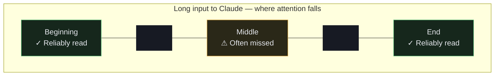

## What is the context window?

The **context window** is everything Claude can "see" at once — its working memory for a conversation. It includes:
- The system prompt and `CLAUDE.md`
- All messages in the conversation so far
- Tool call results (file contents, command output, etc.)
- Any examples or data you've provided

The context window has a **fixed size limit** measured in tokens (roughly 1 token ≈ 1 word). Once you hit the limit, something has to give.

This domain is **15%** of the exam and focuses on keeping agents accurate and dependable as tasks grow long.

## Two ways context goes wrong

### 1. Overflow — too much content
When the context window fills up, older content gets dropped or truncated. If the task description, key constraints, or important earlier results get pushed out, Claude will start making mistakes or re-doing work it already did.

**Example:** You ask Claude to refactor 50 files. By file 30, the original refactoring instructions have been pushed out of context by tool results. Claude starts making inconsistent changes.

### 2. Distraction — irrelevant content degrades quality
You don't have to overflow to have problems. Even with room to spare, filling the context with irrelevant content makes Claude less accurate. It's like trying to focus on a task while someone reads you unrelated information out loud.

**Treat context like a budget:** spend it on what matters; don't waste it on noise.

## Compaction and summarization

When a long conversation grows near the context limit, the harness can **compact** it: older turns are summarized into a shorter form, and that summary replaces the raw history. This frees up space to continue.

**What this means for you:** Don't rely on exact details from early in a long conversation staying accessible verbatim. They may be summarized or lost.

**Best practice:** Keep durable facts — coding conventions, architectural decisions, task requirements — in `CLAUDE.md` or in files. They'll always be readable from disk, even after compaction. Don't leave them only in the conversation transcript.

### Progressive summarization risks
Compaction doesn't lose everything equally. Narratives and general context survive summarization well. What gets lost are specifics: **exact numerical values, percentages, dates, customer-stated expectations, order numbers, status codes**.

If an earlier turn said "the customer expects 99.9% uptime," summarization might compress that to "customer has uptime expectations" — losing the specific threshold that matters for the decision.

**Mitigation:** Extract transactional facts — amounts, order numbers, dates, specific statuses — into a persistent "case facts" block separate from the summarized conversation. Update this block explicitly as new facts emerge, rather than relying on the conversation to preserve them.

## The "lost in the middle" effect

When Claude processes a long input — a long document, a large file, many tool results — it reliably processes information at the **beginning** and **end** of that input. Information buried in the middle is more likely to be missed or underweighted.

This has concrete implications for how you structure inputs:

- **Place key summaries and critical instructions at the BEGINNING** of the input, not midway through.
- **Use explicit section headers** throughout long content to create landmarks. Headers help Claude navigate long inputs and find relevant sections.
- **Organize with position in mind**: if a finding matters, don't bury it in the middle of a long document. Move it to the top or summarize it there.



**In multi-agent pipelines:** If a subagent returns a long result, the orchestrator is most likely to notice what's at the start and end of that result. Structure subagent outputs so the most important finding is always first.

## Verbose tool output trimming

Tool results accumulate in the context window and can consume tokens disproportionate to their actual usefulness. A single database lookup might return 40+ fields when only 5 are relevant to the current task. Multiply that across dozens of tool calls in a long session and you've consumed a large fraction of your context budget on irrelevant fields.

**The fix:** Trim verbose tool outputs to only the relevant fields before they enter the context. You can do this at the tool level (the MCP server returns only what's needed) or in the harness (a PostToolUse hook strips irrelevant fields before they're added to history).

The goal is to keep context tokens focused on the work, not on metadata that nobody is using.

## Retrieval over stuffing

A common mistake: pasting an entire codebase, document, or dataset into the prompt because "Claude might need it."

Instead, let the agent **retrieve just-in-time**: search for the right file, read only the relevant section, query only the needed record. This keeps the context window lean and focused.

**Stuffing (bad):**
```
Here is our entire 50,000-line codebase. Somewhere in here is the auth bug. Fix it.
```

**Retrieval (good):**
```
Find and fix the auth bug. The codebase is in ./src — use your tools to search and read the relevant files.
```

With retrieval, Claude reads what it needs when it needs it, and the context stays filled with relevant content rather than noise.

## Scratchpad files and `/compact`

In long sessions, a subtle degradation starts to appear: Claude begins giving inconsistent answers, referencing "typical patterns" from training instead of specific findings it made earlier in the session, or contradicting conclusions it reached three hours ago.

This happens because the specific findings are getting compacted or pushed deep into context. The model still has them — but they're harder to access than fresh information.

**The scratchpad pattern:** Have agents maintain a scratchpad file that records key findings as they're discovered. Instead of relying on the conversation transcript to hold the answer "the auth bug is in `token.ts` line 47," write it to `scratch.md`. Then, when a later question references that finding, read the scratchpad file rather than trying to recall from conversation history.

**`/compact` command:** When context fills with verbose tool output during an extended session, the `/compact` command reduces context usage by summarizing older turns. Use it proactively when you notice responses becoming less specific.

**Crash recovery for long-running agents:** For agents that run for hours, implement structured state persistence: each agent exports its current state to a known location at regular checkpoints, and a coordinator loads a manifest on resume. This way, if the session is interrupted, the agent can pick up from its last checkpoint rather than starting over.

## Multi-agent handoffs

When an orchestrator delegates a sub-task to a worker agent, the handoff design matters enormously.

**What to send to the worker:**
- A clear, self-contained task description
- Only the context the worker actually needs
- The expected output format

**What the worker should return:**
- The result (e.g. a summary, a code snippet, a list of findings)
- NOT its entire conversation transcript

**Why this matters:** If a worker returns its full transcript, the orchestrator's context fills with irrelevant details from the sub-task. Multiply this across several workers and you've wasted most of your context budget on noise.

**Define a clear contract:** worker receives X, worker returns Y. Treat it like an API.


**Example of a clean handoff:**
- Orchestrator sends: "Analyze `src/auth/` for security vulnerabilities. Return a JSON array of findings with `file`, `line`, and `description` fields."
- Worker reads the files, does the analysis, returns structured JSON.
- Orchestrator gets clean, structured results — no transcript noise.

## Error propagation and escalation

Agents are autonomous, which means errors can compound silently if you're not careful.

### Fail loud, not silent
When a tool fails, the error should be visible in the agent's context — not swallowed. If Claude doesn't know a step failed, it may continue as if it succeeded, producing invalid results.

**Bad pattern:** a tool call fails silently, Claude assumes success, continues building on a broken foundation.
**Good pattern:** the tool returns a clear error message, Claude sees it and decides what to do next.

### Bounded retries
For transient failures (network timeout, rate limit), retrying makes sense — but only a limited number of times. An agent that retries forever will loop indefinitely and never stop.

**Rule of thumb:** retry 2–3 times with a short wait, then fail and escalate.

### Escalate when stuck
An agent should recognize when it cannot proceed on its own and **escalate** rather than guess destructively or loop forever. Escalation means:
- Pausing and asking the user for clarification
- Returning a partial result with a clear explanation of what's missing
- Flagging to an orchestrator that the sub-task failed

**When to escalate:**
- The agent needs a permission it doesn't have
- The task is ambiguous and guessing wrong would be destructive
- Retries have been exhausted
- The agent has been in the same loop for too many iterations

## Human review workflows

Automated AI pipelines are rarely 100% reliable, and aggregate accuracy numbers can be misleading.

### Aggregate accuracy masks field-level gaps
If your pipeline processes documents and reports "97% accuracy overall," that number may hide serious problems on specific document types or specific fields. A pipeline that's perfect on 95% of documents but fails completely on medical invoices has 97% aggregate accuracy — and a significant quality problem.

**Stratified random sampling:** Rather than measuring overall accuracy, sample from specific subgroups — document types, fields, date ranges. Measure error rates separately in high-confidence extractions. Look for novel error patterns that might not show up in summary statistics.

### Field-level confidence scores
When extracting structured data, output a confidence score for each field, not just an overall document score. Calibrate these scores using a labeled validation set: if the model says it's 90% confident, it should be right about 90% of the time.

Use confidence scores to **route review attention**: automatically approve high-confidence fields, route low-confidence or ambiguous extractions to human review. This makes human review time proportional to where the risk actually is, rather than random sampling.

## Information provenance

When Claude synthesizes information from multiple sources, it can lose track of which claim came from where. This creates reliability problems that are hard to debug.

### Source attribution is lost during summarization
When an agent summarizes findings from multiple documents, it often compresses "According to the Q3 report, revenue grew 23%" into "revenue grew recently." The specific number and source are gone. If that number was wrong in the source, you can't trace it back.

**Require claim-source mappings:** Instead of having subagents return prose summaries, require them to return structured outputs that preserve the source for each claim:

```json
{
  "claim": "Revenue grew 23% in Q3",
  "source_url": "https://reports.example.com/q3-2024",
  "source_name": "Q3 2024 Earnings Report",
  "relevant_excerpt": "...total revenue increased 23.4% year-over-year..."
}
```

### Handling conflicting statistics
When multiple credible sources report different numbers for the same metric, the right response is not to pick one and discard the other. Annotate the conflict with source attribution: "Source A reports 23% growth; Source B reports 18% growth. These figures may reflect different calculation methodologies."

### Temporal differences vs. contradictions
A common false contradiction: two sources report different values because they were collected at different times. "Q1: 45% market share" and "Q3: 38% market share" are not contradictions — they're a trend.

**Require publication or collection dates** in structured outputs. Without dates, temporal differences look like contradictions, leading to confusion or incorrect de-duplication.

## What to remember for the exam

- The context window is a **finite shared budget** — guard against overflow and irrelevant content.
- **Progressive summarization** can lose specific numerical values, dates, and facts — extract these into a persistent "case facts" block.
- **Lost in the middle**: place key summaries at the beginning of long inputs; use section headers throughout.
- **Trim verbose tool outputs** before they accumulate — only keep fields that are relevant to the current task.
- Persist durable facts to `CLAUDE.md` or files; they survive compaction, the live transcript does not.
- **Retrieve just-in-time** instead of stuffing everything into the prompt upfront.
- **Scratchpad files** preserve specific findings across long sessions; `/compact` reduces context usage when it fills up.
- Multi-agent handoffs should pass **results, not transcripts** — define a clear input/output contract.
- **Fail loud** (surface errors), **retry with bounds**, and **escalate** when stuck rather than looping or guessing.
- **Aggregate accuracy masks field-level problems** — use stratified sampling and field-level confidence scores for human review routing.
- Require **claim-source mappings** in subagent outputs; annotate conflicting statistics rather than picking one; require dates to distinguish temporal differences from contradictions.
