<div class="callout callout--why">
  <strong>Why this matters</strong>
  Your team tracks everything in Jira. You want to ask Claude: "What are all the open bugs affecting the payment flow?" But Claude can't see Jira — it can only see what you paste in. So you export a CSV, paste it, ask again. It works, but it's manual and stale the moment you paste it. MCP is the standard that lets Claude connect directly to Jira, your database, or your internal docs — without you building a custom connector for every AI tool you use.
</div>

## Learning objectives

By the end of this lesson, you will be able to:

- Add and configure MCP servers in Claude Code at user scope (personal) and project scope (shared with your team)
- Design single-purpose tools with clear descriptions and typed JSON Schema parameters
- Return structured error responses (`isError`, `errorCategory`, `isRetryable`) that guide agents to recover correctly

## What is MCP?

**MCP (Model Context Protocol)** is an open standard that defines how AI applications connect to external tools and data sources. It's the plumbing that lets Claude use tools beyond its built-in capabilities.

Without MCP, if you wanted Claude to query your database or search your internal docs, you'd have to build a custom integration. With MCP, you build a **server** once using the standard protocol, and any MCP-compatible AI application — Claude Code, Claude Desktop, or your own app — can connect to it.

The analogy: MCP is like **USB-C for AI tools**. Different devices, one standard connector.

This domain is **18%** of the exam.

## How it works: host, client, and server

MCP has three roles:

- **Host** — the AI application (e.g. Claude Code, Claude Desktop, your custom app). It runs the client.
- **Client** — built into the host; manages connections to MCP servers.
- **Server** — a separate program you write or install that exposes tools, data, or prompts.

```
You → Claude Code (host + client) → MCP Server (your tools/data)
```



```mermaid
flowchart LR
    You(["You"]) --> CC["Claude Code\nHost + Client"]
    CC <-->|"MCP Protocol"| Srv["MCP Server\nyour tools & data"]
    Srv <--> Ext[("External API\nor Database")]
    style You fill:#252a38,stroke:#3a4058
    style Srv fill:#3a2a24,stroke:#d97757
```

When you ask Claude Code to do something, it can invoke tools on connected MCP servers, just like it can use its built-in Read or Edit tools.

## The three server primitives

Every MCP server can expose up to three types of capabilities:

### Tools — actions the model can call
Tools are functions. Claude calls them to take action or retrieve data.

**Examples:**
- `search_jira_issues(query)` — search your project management system
- `run_sql_query(sql)` — query a database
- `send_slack_message(channel, text)` — post a message
- `get_weather(city)` — fetch current weather

The model decides *when* to call a tool based on the tool's description. Tools are **model-controlled**.

### Resources — data the application loads into context
Resources are read-only data that can be loaded into the conversation as context. Unlike tools (which the model calls), resources are controlled by the **application or user**.

**Examples:**
- The contents of a specific file
- A database record
- A user's profile

Think of resources as "here is data I want Claude to be aware of" rather than "here is an action Claude can take."

Exposing content catalogs as MCP resources is a useful optimization: instead of having the agent call a tool to discover what documents exist (burning tool calls on exploration), you surface the catalog as a resource that loads into context directly. The agent then knows what's available without needing to search.

### Prompts — reusable templates
Servers can also expose **prompt templates** — pre-written prompts that users or applications can invoke. These often surface as slash commands in Claude Code.

**Example:** An MCP server for your codebase might expose a `/explain-function` prompt template that, when invoked, fills in the current function and asks Claude to explain it.

**Tools vs. Resources at a glance:**

```mermaid
flowchart LR
    subgraph T["Tools — actions"]
        T1["`search_jira_issues(query)`"]
        T2["`run_sql_query(sql)`"]
        T3["`send_slack_message(text)`"]
        TC["🤖 Model-controlled\nClaude decides when to call"]
    end
    subgraph R["Resources — data"]
        R1["File contents"]
        R2["Database record"]
        R3["Document catalog"]
        RC["👤 App/user-controlled\nLoaded into context directly"]
    end
    style T fill:#16271c,stroke:#5bbf7a
    style TC fill:#0f1d14,stroke:#5bbf7a,color:#e6e8ee
    style R fill:#252a38,stroke:#3a4058
    style RC fill:#171a23,stroke:#3a4058,color:#e6e8ee
```



## Transports — how client and server communicate

The transport is the communication channel between the MCP client and server:

### stdio (local subprocess)
The server runs as a **child process** on the same machine. The client communicates via stdin and stdout.

```
Claude Code → (stdin/stdout) → local MCP server process
```

- Best for: developer tools, local file access, personal integrations
- Simple to set up, no network required

### HTTP / Streamable HTTP (remote server)
The server runs somewhere on the network and exposes an HTTP endpoint.

```
Claude Code → (HTTP) → remote MCP server (could be anywhere)
```

- Best for: shared team tools, hosted services, multi-user servers
- Allows centralized deployment and access control

**In Claude Code**, you add MCP servers with:
```bash
claude mcp add my-server --command "node my-server.js"   # stdio
claude mcp add my-api --url "https://my-api.com/mcp"     # HTTP
```

## MCP server scoping

Where you configure an MCP server determines who can use it and whether it's shared with your team.

### Project scope — `.mcp.json`
Defined in `.mcp.json` at the project root. This file is **committed to git**, so it's shared with all team members. Everyone who checks out the project gets the same MCP server configuration automatically.

Use project scope for: shared team integrations, project-specific databases, CI-relevant tools.

### User scope — `~/.claude.json`
Defined in your global Claude config. This is **personal and not shared** — it lives on your machine only. Use it for personal or experimental integrations you don't want to impose on the team.

### Environment variable expansion
`.mcp.json` supports `${ENV_VAR}` syntax so you can reference credentials without committing secrets:

```json
{
  "mcpServers": {
    "github": {
      "command": "node",
      "args": ["github-mcp-server.js"],
      "env": {
        "GITHUB_TOKEN": "${GITHUB_TOKEN}"
      }
    }
  }
}
```

Each developer sets their own `GITHUB_TOKEN` environment variable. The token is never in the committed file.

### Discovery
All configured MCP servers — regardless of scope — are discovered at connection time and available simultaneously. You don't need to manually activate them per session.

### Community vs. custom servers
For standard integrations (Jira, GitHub, Slack, databases), start with community MCP servers — they're already built and tested. Reserve custom MCP server development for team-specific workflows that community servers don't cover.

## MCP error handling

When tools fail, how you communicate that failure back to the agent determines whether the agent can recover intelligently.

### The `isError` flag
MCP tool responses include an `isError` flag. Setting `isError: true` explicitly signals a failure to the agent — distinct from returning empty results. The agent uses this signal to decide whether to retry, escalate, or try a different approach.

**Important distinction:** a tool that returns `isError: false` with an empty array (`[]`) is saying "the query succeeded, there were just no matches." A tool that returns `isError: true` is saying "something went wrong." These are completely different situations and the agent should handle them differently.

### Error categories
Structure your error responses with enough information for the agent to make good decisions:

| Category | Meaning | Agent action |
|---|---|---|
| Transient | Timeout, service temporarily unavailable | Retry after a short wait |
| Validation | Bad input (wrong type, missing field) | Fix the call, don't retry as-is |
| Business | Policy violation (e.g. item out of stock) | Report to user, don't retry |
| Permission | Access denied | Escalate, don't retry |

```mermaid
flowchart TD
    F["Tool returns isError: true"] --> C{"errorCategory?"}
    C -->|"transient"| R["Retry after wait"]
    C -->|"validation"| V["Fix the call\ndo not retry as-is"]
    C -->|"business"| B["Report to user\ndo not retry"]
    C -->|"permission"| P["Escalate\ndo not retry"]
    style R fill:#16271c,stroke:#5bbf7a,color:#e6e8ee
    style V fill:#2a2818,stroke:#d9a441,color:#e6e8ee
    style B fill:#2a1818,stroke:#e06c6c,color:#e6e8ee
    style P fill:#2a1818,stroke:#e06c6c,color:#e6e8ee
    style F fill:#252a38,stroke:#3a4058
```



Return this as structured metadata — at minimum an `errorCategory`, an `isRetryable` boolean, and a human-readable description:

```json
{
  "isError": true,
  "errorCategory": "transient",
  "isRetryable": true,
  "description": "Database connection timed out. The service is typically available within 30 seconds."
}
```

### Error handling in multi-agent systems
Subagents should handle transient failures locally — retry with backoff, then either succeed or give up. Only escalate errors to the coordinator when the subagent cannot resolve them. When escalating, include partial results if any work was completed before the failure. This prevents the coordinator from waiting indefinitely and lets it make an informed decision about how to proceed.

## Tool count and tool_choice

### Keep tool counts low
Giving an agent too many tools degrades performance. When an agent has 18 tools to choose from instead of 4–5, it makes worse selection decisions — the cognitive overhead of choosing among many options introduces errors.

The right approach in a multi-agent system: each subagent gets only the tools relevant to its specific role. A file-reading subagent doesn't need database tools. A database subagent doesn't need file-editing tools. Tight tool sets produce more reliable behavior.

### `tool_choice` — controlling whether and which tool gets called
`tool_choice` is an API parameter that controls the model's tool-calling behavior:

| Value | Behavior |
|---|---|
| `"auto"` | Model decides whether to call a tool or return text. May return conversational text instead of a tool call. |
| `"any"` | Model **must** call a tool, but chooses which one from the available set. |
| `{"type": "tool", "name": "extract_data"}` | Model **must** call this specific tool. |

**Use `tool_choice: "any"`** when you need to guarantee a tool call happens instead of the model returning a prose response. This is common in structured output workflows where you need machine-parseable results on every turn.

**Use `tool_choice: {"type": "tool", "name": "..."}`** when you need to force a specific extraction or action step in a pipeline.

## Built-in tools (Grep, Glob, Read, Write, Edit, Bash)

Claude Code has a set of built-in tools for working with code. Understanding what each one is for helps you write better instructions and understand agent behavior.

### Grep — search file contents
Grep searches file *contents* for patterns. Use it to find where a function is defined, where a specific error message appears, which files import a particular module. Think of it as full-text search across your codebase.

**Example uses:** finding all files that call `validateToken`, finding where a specific error string appears, finding all import statements for a module.

### Glob — find files by name pattern
Glob matches file *paths* by pattern. Use it when you know something about the file's name or location but not its contents.

**Example:** `**/*.test.tsx` finds all test files anywhere in the project. `src/routes/**/*.ts` finds all TypeScript files under the routes directory.

### Read and Write — full file operations
Read loads an entire file into context. Write creates or replaces a file entirely. Use Read when you need to understand the full content of a file; use Write when creating a new file from scratch.

### Edit — targeted in-place modifications
Edit makes targeted changes to specific parts of a file using unique text matching. It's more efficient than Read + Write for small changes because it only sends the diff.

**When Edit fails:** Edit requires the target text to be unique in the file. If the same string appears multiple times, Edit can't tell which instance to change and will fail. In that case, fall back to Read + Write — read the full file, make the change in memory, write the whole file back.

### Bash — arbitrary shell commands
Bash executes shell commands directly. Use it for running tests, build commands, git operations, or anything else that needs the shell.

### Building codebase understanding incrementally
A common mistake is trying to read every file upfront before doing any work. Instead, build understanding incrementally:

1. Use Grep to find entry points — the `main` function, the router configuration, the top-level module
2. Read those specific files
3. Follow imports and references to the next relevant files
4. Read only what you actually need

This keeps the context window lean and focused on what's actually relevant to the task.

## Designing good tools

When you write an MCP server, the quality of your tool design determines whether Claude uses your tools correctly.

### Right granularity
Each tool should do **one clear thing**. Avoid tools that are too broad or too narrow.

| Too broad | Too narrow | Just right |
|---|---|---|
| `do_database_operation(type, ...)` | `get_user_by_id(id)`, `get_user_by_email(email)`, ... | `find_user(query)` |

If a tool does too many things, the model won't know when to use it. If it's too narrow, the model needs 10 calls to do what 1 should do.

### Clear names and descriptions
The tool's **description is the model's only guide** to when and how to use it. Write descriptions for Claude, not for humans.

```json
{
  "name": "search_issues",
  "description": "Search for Jira issues by keyword. Use this when the user asks about tickets, bugs, or tasks. Returns a list of matching issues with title, status, and URL."
}
```

A vague description like "gets issues" will cause Claude to misuse or ignore the tool.

### Typed inputs with JSON Schema
Define exactly what each parameter expects:

```json
{
  "parameters": {
    "query": {"type": "string", "description": "Search terms"},
    "status": {"type": "string", "enum": ["open", "closed", "all"], "default": "open"},
    "limit": {"type": "integer", "minimum": 1, "maximum": 50, "default": 10}
  },
  "required": ["query"]
}
```

Enums prevent invalid values. Required fields prevent incomplete calls. Types prevent type errors.

### Helpful error messages
When something goes wrong, return a message the model can act on — not a stack trace.

| Bad error | Good error |
|---|---|
| `NullPointerException at line 42` | `"User not found. Try searching by email instead of username."` |
| `403 Forbidden` | `"Permission denied. This action requires the 'admin' role."` |

Claude will use the error message to decide what to try next. Make it actionable.

### Least privilege
Expose only what's necessary. If a tool only needs to *read* data, don't give it write access. Dangerous or irreversible actions (delete, publish, send) should require explicit confirmation in the tool's logic.

## What to remember for the exam

- MCP = open protocol; host runs a client, client connects to servers.
- **Primitives**: tools (model-called actions), resources (read-only data loaded by app/user), prompts (templates).
- **Transports**: stdio for local subprocesses, HTTP for remote/shared servers.
- **Project scope** (`.mcp.json`) is committed to git and shared; **user scope** (`~/.claude.json`) is personal. Use `${ENV_VAR}` for credentials in `.mcp.json`.
- The `isError` flag distinguishes failures from valid empty results — the agent needs to know the difference.
- Structured error responses should include `errorCategory`, `isRetryable`, and a description.
- **Tool count matters**: 4–5 focused tools per subagent outperforms 18 general tools.
- `tool_choice: "any"` guarantees a tool call; `tool_choice: "auto"` may return text instead.
- **Built-in tools**: Grep for content search, Glob for file path patterns, Edit for targeted changes (fall back to Read+Write when Edit fails due to non-unique match), Bash for shell commands.
- Expose content catalogs as **resources** to reduce exploratory tool calls.
- Good tools are: **single-purpose**, **well-described** (for the model), **typed**, and **least-privilege**.
- Tool descriptions are the model's only signal for when to use a tool — write them carefully.
