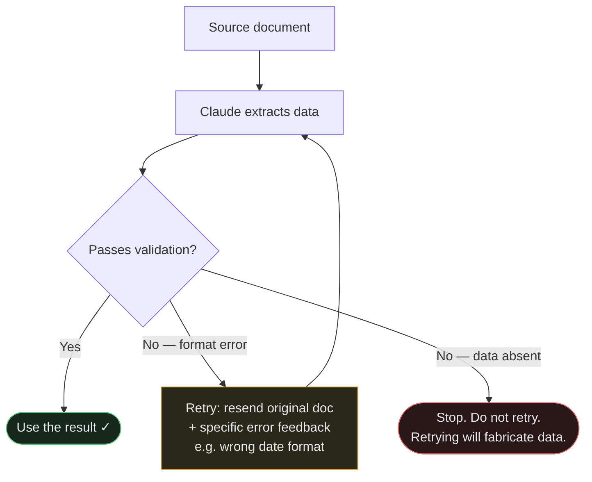

  <strong>Why this matters</strong>
  Once you can write reliable prompts, the next step is building pipelines — automated workflows that extract structured data, validate it, retry on failure, and process thousands of documents in batch. This lesson covers the API-level patterns that make those pipelines robust. These patterns are tested heavily on the exam.

## Learning objectives

By the end of this lesson, you will be able to:

- Use `tool_use` with a JSON schema to guarantee structured output without syntax errors
- Design validation-retry loops that handle format errors without fabricating missing data
- Choose when to use the Message Batches API and understand its trade-offs
- Use independent review instances to catch more issues than self-review

  <strong>Prerequisites</strong>
  Read <strong>Prompt Engineering Fundamentals</strong> first. This lesson builds directly on context engineering, few-shot examples, and prompt-based JSON output.

## `tool_use` for structured output — the most reliable method

  <strong>Exam knowledge — Claude API</strong>
  <code>tool_use</code> and <code>tool_choice</code> are parameters you set when making direct Claude API calls. They are not configurable from the Claude Code CLI. The exam tests these as structured output techniques — you need to understand what they do and when to use them, even if you don't write the API code yourself.

For production pipelines that require structured output, using `tool_use` with a JSON schema is the most reliable approach — it eliminates JSON syntax errors entirely. Instead of asking Claude to "write JSON," you define a tool with a schema, and Claude fills in the fields by making a tool call.

The schema enforces structure at the API level. Claude doesn't need to format JSON — it just populates named fields.

**`tool_choice` options recap:**
- `"auto"` — model may return text instead of calling a tool. Not reliable for pipelines.
- `"any"` — model must call a tool, chooses which. Guarantees a tool call.
- `{"type": "tool", "name": "extract_data"}` — model must call this specific tool. Guarantees the specific schema you defined.

**What schemas prevent and what they don't:**

Strict JSON schemas eliminate **syntax errors** — malformed JSON, missing brackets, extra prose. They do NOT prevent **semantic errors** — values in the wrong fields, totals that don't sum correctly, plausible-sounding but wrong data. Schema enforcement is structural, not logical. Validate the values, not just the shape.

## Validation-retry loops

Even with good prompting, extractions sometimes fail validation. The right response is a structured retry — not just re-sending the original request.

**When retrying works:**
- Format mismatches (dates in wrong format, numbers as strings)
- Structural output errors (missing required fields, wrong nesting)

**When retrying doesn't work:**
- The required information is absent from the source document. If the document doesn't contain an order number, retrying will just produce a fabricated one. Check for data absence before retrying.

**How to retry effectively:**

Send the original document + the failed extraction + specific validation errors. Don't just say "try again" — say "the `order_date` field should be ISO 8601 format (YYYY-MM-DD), but you returned 'June 3rd, 2024'."

**Adding observability:** Include a `detected_pattern` field in your extraction schema for findings or classifications. When you start seeing false positives, this field lets you analyze what patterns the model is detecting before dismissing them — helping you refine your criteria rather than just discarding results.

## Message Batches API

  <strong>Exam knowledge — Claude API</strong>
  The Message Batches API is a direct Claude API feature — it is not available through the Claude Code CLI. The exam tests this as a cost-optimization strategy for offline, high-volume workloads. You need to know when to use it and when not to.

When you need to run many independent AI tasks, the Message Batches API lets you submit them together at a significant cost reduction.

**The key facts:**
- **50% cost savings** compared to the synchronous API
- Processing window of up to **24 hours** — no guaranteed latency SLA
- Use `custom_id` fields on each request so you can match responses back to the original inputs and handle failures per-request

**When to use it:**
- Overnight batch reports
- Weekly document processing
- Nightly test case generation
- Any workload where latency doesn't matter and you're running many similar tasks

**When NOT to use it:**
- Pre-merge checks that developers are waiting for — they need a response in seconds, not hours
- Any blocking workflow where the result is needed before the next step can proceed
- Multi-turn tool calling is also not supported within a single Batch API request — each request is a single, standalone message exchange

Think of the Batches API like a printer queue: you submit a batch at night, and the results are ready in the morning. Not appropriate for anything that holds up a person or a pipeline.

## Multi-instance and multi-pass review

### Self-review has a fundamental limitation
When you ask the same model instance to review code it just wrote, it retains the reasoning context from generation. This makes it less likely to question decisions it already made. The model essentially "remembers" why it did something, which anchors it toward defending rather than critiquing.

An **independent review instance** — a fresh session with no prior reasoning context about the code — catches more subtle issues than a self-review instruction like "now critically review your work."

### Multi-pass review in practice
For thorough code review, combine two passes:

1. **Per-file local analysis passes** — each file gets its own agent run, focused on issues within that file. No cross-file noise.
2. **Cross-file integration pass** — a separate agent that reviews the findings from step 1 and looks for cross-cutting issues: API contract violations, inconsistent error handling patterns, dependency cycle implications.

This two-step approach catches both local bugs and system-level issues that single-agent review tends to miss.

```mermaid
flowchart TD
    Code["Code to review"] --> Split["Split by file"]
    Split --> F1["File A agent\nlocal analysis only"]
    Split --> F2["File B agent\nlocal analysis only"]
    Split --> F3["File C agent\nlocal analysis only"]
    F1 --> Int["Integration agent\nreviews all findings for cross-file issues"]
    F2 --> Int
    F3 --> Int
    Int --> Report(["Final review report"])
    style Int fill:#3a2a24,stroke:#d97757
    style Report fill:#16271c,stroke:#5bbf7a,color:#e6e8ee
```

## What to remember for the exam

- **`tool_use` with a schema** is the most reliable structured output method — eliminates syntax errors but not semantic errors.
- `tool_choice: "any"` guarantees a tool call; `tool_choice: "auto"` may return text instead.
- `tool_choice: {"type": "tool", "name": "..."}` forces a specific tool — use in pipelines that need a specific extraction schema.
- **Validation-retry loops** work for format/structure errors; don't retry when the source data is simply absent — retrying will fabricate a value.
- Include specific error feedback when retrying, not just "try again."
- **Message Batches API**: 50% savings, up to 24h processing window, use `custom_id` for correlation. For latency-tolerant workloads only — not blocking workflows. No multi-turn tool calling within a single batch request.
- **Independent review instances** catch more issues than self-review — the generator retains reasoning context that anchors it away from critique.
- For code review: per-file local passes + separate cross-file integration pass prevents attention dilution and contradictory findings.
