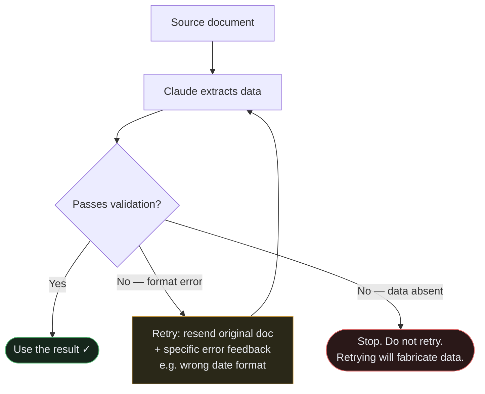

## What is prompt engineering?

A **prompt** is any message you send to an AI model. **Prompt engineering** is the practice of writing prompts that reliably get the output you want.

Bad prompting is the most common reason AI outputs feel unhelpful or inconsistent — not because the model is incapable, but because it wasn't given enough information to succeed. Claude is powerful but literal: it does what you actually say, not what you meant to say.

This domain is **20%** of the exam and is the most immediately practiceable — every message you type in Claude Code is a prompt.

## Context engineering: what you put in matters more than how you phrase it

The biggest lever in modern prompting isn't clever wording — it's **what information you include**.

Claude can only work with what's in its context window (its "working memory" for the conversation). If a relevant file isn't included, Claude doesn't know about it. If you don't say what format you want, Claude will guess.

**Think of it like briefing a contractor who just walked in:**
- A bad brief: "Fix the bug."
- A good brief: "Here's the file with the bug (`auth.py`, lines 42–67). The bug causes login to fail when the email has a capital letter. Please fix it without changing the function signature."

The second brief gives Claude the file, the problem, the constraint, and the expected scope. That's context engineering.

**What to include:**
- The relevant files or code snippets
- The goal (what done looks like)
- Constraints (what not to change, what format to use)
- Examples if the output format is non-obvious

**What to leave out:**
- Unrelated files or history that don't affect this task
- Background information the model doesn't need

## Be explicit and specific

Claude follows instructions literally. Vague prompts produce vague results.

| Vague | Explicit |
|---|---|
| "Make it better" | "Refactor this function to reduce nesting — max 2 levels deep" |
| "Add some tests" | "Write unit tests for the `validateEmail` function covering: valid email, missing @, empty string" |
| "Fix the style" | "Format this file with 2-space indentation and single quotes" |

**Tips:**
- State the **goal**, the **constraints**, and the **output format** you want.
- Prefer positive instructions ("respond with only the JSON object") over negative ones ("don't include extra text") — tell Claude what to do, not what not to do.
- If steps matter, number them explicitly: "First do X, then Y, then Z."

## Explicit criteria for precision

A common mistake in review or classification prompts is using vague quality language — "be conservative," "only flag high-confidence issues," "don't be too strict." This almost never works.

The problem: vague instructions don't actually change what gets flagged. "Be conservative" means different things in different contexts. The model can't calibrate to a standard it can't measure against.

What works instead is **specific categorical criteria**:

| Vague | Specific |
|---|---|
| "Only flag high-confidence issues" | "Flag comments only when the claimed behavior contradicts the actual code behavior" |
| "Be conservative about security findings" | "Report only findings where the input reaches a sink without sanitization — skip issues that require chained errors to exploit" |
| "Skip minor issues" | "Skip style issues, naming conventions, and local patterns. Report only: logic bugs, security vulnerabilities, and data loss risks." |

**Why false positives erode trust:** If your review prompt flags minor style issues alongside real bugs, developers will start dismissing findings without reading them — including the accurate ones. Define precisely which categories to report and which to skip.

## Few-shot examples

Sometimes describing what you want in words is harder than just showing it. **Few-shot prompting** means providing 2–4 examples of input → output before asking for the real thing.

This is especially powerful for:
- Formatting (you want output in a specific shape)
- Classification (you want Claude to categorize things a specific way)
- Tone (you want a particular writing style)

**Example prompt:**
```
Convert each sentence to title case. Keep acronyms uppercase.

Input: the api returned an error
Output: The API Returned an Error

Input: user authentication failed
Output: User Authentication Failed

Input: loading mcp server configuration
Output:
```

The blank `Output:` at the end is intentional — that's what you actually send to Claude. You supply the completed examples to establish the pattern, then leave the final output empty. Claude fills it in (`Loading MCP Server Configuration` here).

Claude will imitate the pattern. Three examples is usually enough — the model learns the rule from demonstration.

**Keep examples consistent:** if your examples contain a mistake, Claude will reproduce it.

## Structured output (getting JSON back)

Many real applications need Claude to return data a program can parse — not prose, but a strict JSON object. Here's how to get it reliably:

**1. Describe the exact schema**
```
Return a JSON object with these fields:
- "name": string (the person's full name)
- "email": string (email address, or null if not found)
- "confidence": number between 0 and 1
```

**2. Provide one example**
```json
{"name": "Jane Smith", "email": "jane@example.com", "confidence": 0.95}
```

**3. Ask for only the JSON**
```
Return only the JSON object. No explanation, no markdown code fences.
```

If a downstream program is parsing the output, even one extra line of prose will break it.

**Design for missing information:** Use nullable fields (`"email": string | null`) for data that may not exist. Without nullable fields, the model is pressured to fabricate a value. With them, it can honestly return `null`.

**Extensible enums:** For category fields where you can't enumerate all possible values, use an `"other"` option paired with a detail string: `"category": "billing" | "technical" | "other"` plus `"category_detail": string`. This prevents the model from shoehorning an edge case into an ill-fitting category.

## `tool_use` for structured output — the most reliable method

<div class="callout callout--api">
  <strong>Exam knowledge — Claude API</strong>
  <code>tool_use</code> and <code>tool_choice</code> are parameters you set when making direct Claude API calls. They are not configurable from the Claude Code CLI. The exam tests these as structured output techniques — you need to understand what they do and when to use them, even if you don't write the API code yourself.
</div>

For production pipelines that require structured output, using `tool_use` with a JSON schema is the most reliable approach — it eliminates JSON syntax errors entirely. Instead of asking Claude to "write JSON," you define a tool with a schema, and Claude fills in the fields by making a tool call.

The schema enforces structure at the API level. Claude doesn't need to format JSON — it just populates named fields.

**`tool_choice` options recap:**
- `"auto"` — model may return text instead of calling a tool. Not reliable for pipelines.
- `"any"` — model must call a tool, chooses which. Guarantees a tool call.
- `{"type": "tool", "name": "extract_data"}` — model must call this specific tool. Guarantees the specific schema you defined.

**What schemas prevent and what they don't:**

Strict JSON schemas eliminate **syntax errors** — malformed JSON, missing brackets, extra prose. They do NOT prevent **semantic errors** — values in the wrong fields, totals that don't sum correctly, plausible-sounding but wrong data. Schema enforcement is structural, not logical. Validate the values, not just the shape.

## Validation-retry loops

Even with good prompting, extractions sometimes fail validation. The right response is a structured retry — not just re-sending the original request.

**When retrying works:**
- Format mismatches (dates in wrong format, numbers as strings)
- Structural output errors (missing required fields, wrong nesting)

**When retrying doesn't work:**
- The required information is absent from the source document. If the document doesn't contain an order number, retrying will just produce a fabricated one. Check for data absence before retrying.



**How to retry effectively:**

Send the original document + the failed extraction + specific validation errors. Don't just say "try again" — say "the `order_date` field should be ISO 8601 format (YYYY-MM-DD), but you returned 'June 3rd, 2024'."

**Adding observability:** Include a `detected_pattern` field in your extraction schema for findings or classifications. When you start seeing false positives, this field lets you analyze what patterns the model is detecting before dismissing them — helping you refine your criteria rather than just discarding results.

## A reliable prompt structure

When you need consistent results, structure your prompt in this order:

1. **Role / task** — what you want done ("You are a code reviewer. Review the following function for bugs.")
2. **Context** — the relevant data, files, or background
3. **Instructions** — constraints, steps, tone
4. **Examples** — few-shot, if the output shape is non-obvious
5. **Output format** — exact shape ("Return a JSON array of objects with `line` and `issue` fields.")

You don't need all five sections for every prompt — a simple task just needs a clear instruction. But for complex or repeated tasks, this structure prevents ambiguity.

## Message Batches API

<div class="callout callout--api">
  <strong>Exam knowledge — Claude API</strong>
  The Message Batches API is a direct Claude API feature — it is not available through the Claude Code CLI. The exam tests this as a cost-optimization strategy for offline, high-volume workloads. You need to know when to use it and when not to.
</div>

When you need to run many independent AI tasks, the Message Batches API lets you submit them together at a significant cost reduction.

**The key facts:**
- **50% cost savings** compared to the synchronous API
- Processing window of up to **24 hours** — no guaranteed latency SLA
- Use `custom_id` fields on each request so you can match responses back to the original inputs and handle failures per-request

**When to use it:**
- Overnight batch reports
- Weekly document processing
- Nightly test case generation
- Any workload where latency doesn't matter and you're running many similar tasks

**When NOT to use it:**
- Pre-merge checks that developers are waiting for — they need a response in seconds, not hours
- Any blocking workflow where the result is needed before the next step can proceed
- Multi-turn tool calling is also not supported within a single Batch API request — each request is a single, standalone message exchange

Think of the Batches API like a printer queue: you submit a batch at night, and the results are ready in the morning. Not appropriate for anything that holds up a person or a pipeline.

## Multi-instance and multi-pass review

### Self-review has a fundamental limitation
When you ask the same model instance to review code it just wrote, it retains the reasoning context from generation. This makes it less likely to question decisions it already made. The model essentially "remembers" why it did something, which anchors it toward defending rather than critiquing.

An **independent review instance** — a fresh session with no prior reasoning context about the code — catches more subtle issues than a self-review instruction like "now critically review your work."

### Multi-pass review in practice
For thorough code review, combine two passes:

1. **Per-file local analysis passes** — each file gets its own agent run, focused on issues within that file. No cross-file noise.
2. **Cross-file integration pass** — a separate agent that reviews the findings from step 1 and looks for cross-cutting issues: API contract violations, inconsistent error handling patterns, dependency cycle implications.

This two-step approach catches both local bugs and system-level issues that single-agent review tends to miss.

```mermaid
flowchart TD
    Code["Code to review"] --> Split["Split by file"]
    Split --> F1["File A agent\nlocal analysis only"]
    Split --> F2["File B agent\nlocal analysis only"]
    Split --> F3["File C agent\nlocal analysis only"]
    F1 --> Int["Integration agent\nreviews all findings for cross-file issues"]
    F2 --> Int
    F3 --> Int
    Int --> Report(["Final review report"])
    style Int fill:#3a2a24,stroke:#d97757
    style Report fill:#16271c,stroke:#5bbf7a,color:#e6e8ee
```



## What to remember for the exam

- **Context engineering**: put the right information in the window; remove noise.
- Claude follows instructions literally — be explicit about goal, constraints, and output format.
- **Specific categorical criteria** beat vague quality adjectives ("be conservative"). Define which categories to report and skip.
- False positives erode trust in the accurate findings too — precision matters.
- **Few-shot examples** beat prose descriptions for teaching output format.
- For JSON: describe the schema, show an example, ask for only the object. Use nullable fields for missing data; use `"other"` + detail for extensible enums.
- **`tool_use` with a schema** is the most reliable structured output method — eliminates syntax errors but not semantic errors.
- `tool_choice: "any"` guarantees a tool call; `tool_choice: "auto"` may return text.
- **Validation-retry loops** work for format/structure errors; don't retry when the source data is simply absent.
- **Message Batches API**: 50% savings, up to 24h processing window, use `custom_id` for correlation. For latency-tolerant workloads only — not blocking workflows.
- **Independent review instances** catch more issues than self-review — the generator retains reasoning context that anchors it away from critique.
- Prefer positive instructions ("do X") over negative ones ("don't do Y").
